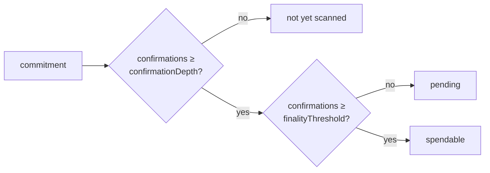

# Syncing

A wallet holds no state until it scans the pool. Syncing reads the pool's events from the wallet's
last checkpoint to the chain head and builds up its note set, which balances and history are then
computed from.

## Running a sync

`sync()` scans from the wallet's last synced block to the chain head and reports the window it
covered:

```ts
const { fromBlock, syncedThrough, scanned } = await wallet.sync();
```

- `fromBlock` — where this scan resumed from (the last checkpoint + 1).
- `syncedThrough` — the block the wallet has now scanned through.
- `scanned` — `false` when the head had not advanced past the checkpoint, i.e. there was no work to
  do.

## Checkpoints and resume

Scan state persists through the [storage adapter](./adapters). A later `sync()` resumes from the
last checkpoint rather than rescanning from the pool's deploy block, so repeat syncs only cover new
blocks.

`syncStatus()` is a cheap read of that state — the persisted checkpoint and whether a sync is
currently in flight. It does no network calls and changes nothing:

```ts
const { syncedThrough, syncing } = await wallet.syncStatus();
```

Ephemeral wallets are the exception: they are in-memory only and do not persist a checkpoint (see
[Wallets](./wallets)).

## Reorg safety

Two optional fields on the pool config guard against chain reorganizations. Both default to `0`:

```ts
pool: {
  // …
  confirmationDepth: 12,  // stay 12 blocks behind the head when scanning
  finalityThreshold: 12,  // count commitments as spendable only after 12 confirmations
}
```

- **`confirmationDepth`** controls what gets scanned. A sync scans to `head − confirmationDepth`, and
  only commitments up to that point are persisted, so a reorg of that depth or shallower cannot
  remove a note the wallet has already scanned. With the default `0`, syncs scan to the head.
- **`finalityThreshold`** controls the balance view. It is the number of confirmations a commitment
  needs before `balances()` counts it as `spendable` rather than `pending`. With the default `0`, a
  commitment counts as spendable as soon as it is scanned.

Both gate on a commitment's **confirmations** — how many blocks behind the chain head it is:
`confirmationDepth` decides whether it is scanned at all, and `finalityThreshold` decides whether a
scanned commitment is spendable or pending.



With both at their default of `0`, a commitment is scanned and spendable as soon as its block is
reached.

## Event sources

By default, syncing reads pool events from the RPC endpoints in `rpc.urls`. You can optionally
supply an indexer as the primary event source; when set, RPC covers the tail and results are
verified against the on-chain root. Omit it to sync purely from RPC:

```ts
const sdk = await createArmadaSdk({
  // …
  indexer: { url: 'https://…' },
});
```

## Scan events

`wallet.on(event, listener)` subscribes to scan and balance events and returns a function that
unsubscribes:

```ts
const unsubscribe = wallet.on('balance:updated', ({ tokenHash, tokenAddress, spendable, pending }) => {
  console.log(tokenHash, tokenAddress, spendable, pending);
});

// later
unsubscribe();
```

The events and their payloads:

| Event | Payload |
| --- | --- |
| `scan:started` | `{ fromBlock, toBlock }` |
| `scan:progress` | `{ syncedThrough, fraction }` |
| `scan:complete` | `{ syncedThrough }` |
| `scan:error` | `{ error }` |
| `note:received` | `{ tokenHash, tokenAddress, value, memo?, senderShieldedAddress? }` |
| `balance:updated` | `{ tokenHash, tokenAddress, spendable, pending }` |

Both token events carry the same pair of identifiers `balances()` returns: `tokenHash` — the
canonical 32-byte hash, without a `0x` prefix — and `tokenAddress`, its ERC-20 address. Join a live
event back to a `balances()` snapshot on `tokenHash`, or key your UI on `tokenAddress`.

On a `sync()` that does work, `scan:started` fires first and `scan:complete` last. In between,
`balance:updated` fires for each token whose balance changed — a token that is fully spent emits a
zero. If the scan throws, `scan:error` fires.
