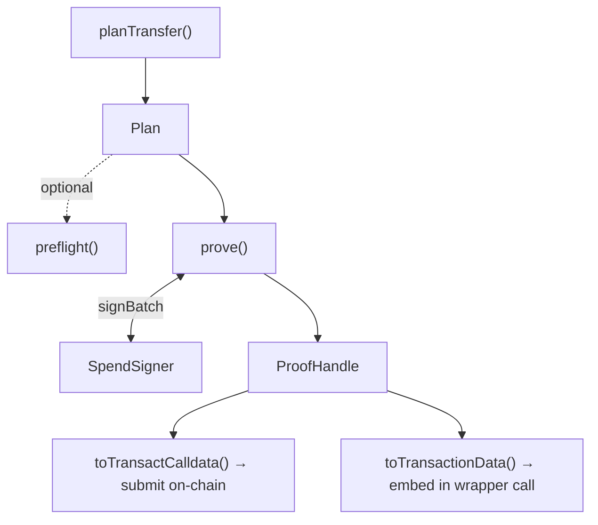

# Transactions

Moving shielded funds is a three-step flow:

1. **Plan** — select the notes to spend and compute the outputs and change.
2. **Preflight** — run cheap checks before committing to the expensive proof (optional).
3. **Prove** — generate the zero-knowledge proof and produce the calldata to submit on-chain.

A **transfer** sends funds to another shielded (`0zk`) address. An **unshield** withdraws funds to a
public address. A single plan can do both at once.



## Fees

Planning requires a fee quote. A quote is issued by the broadcaster that will submit your
transaction, and the SDK consumes it as-is:

```ts
interface FeeQuote {
  schedule: Record<string, string>;    // per-operation fees, USDC base units (6dp), as strings
  broadcasterShieldedAddress: string;
  feesCacheId: string;
  expiresAt: number;                    // unix seconds
}
```

`schedule` is keyed by operation (`transfer`, `unshield`, …). How you obtain a quote is specific to
your deployment's broadcaster.

## Plan a transfer

`planTransfer` selects input notes and builds a plan. Each output is a shielded address, an amount
in the token's base units, and an optional memo:

```ts
const plan = await wallet.planTransfer({
  outputs: [{ to0zk: '0zk…', amount: 1_000_000n, memo: 'invoice-42' }],
  fee: feeQuote,
});
```

The spent token defaults to the pool's USDC; set `tokenAddress` to spend another token the wallet
holds. The returned plan's `summary` describes the selection:

```ts
plan.summary.inputTotal;  // total value of the selected input notes
plan.summary.outputs;     // the resolved outputs
plan.summary.changeValue; // change returned to the wallet
plan.summary.feeOutput;   // the fee note, when one is present
```

If no single tree's spendable notes can cover the amount plus fee, `planTransfer` throws
`InsufficientBalanceError`. If the pool config lists `supportedShapes` and the plan's circuit shape
is not among them, it throws `UnsupportedCircuitShapeError` up front, rather than failing later
during proving.

## Unshield to a public address

Add an `unshield` to withdraw to a public recipient. Outputs and an unshield can be combined in one
plan:

```ts
const plan = await wallet.planTransfer({
  outputs: [],
  unshield: { recipient: '0x…', amount: 1_000_000n },
  fee: feeQuote,
});
```

The unshield is reflected in `plan.summary.unshield` as `{ recipient, value }`. For cross-chain
unshields, `unshield` also accepts `adaptParams` and `adaptContract` that bind the destination into
the transaction; a decoded `adaptBinding` is surfaced to the signer for inspection.

## Preflight

`preflight` runs a set of cheap checks over a plan before proving. It returns an overall `ok` plus a
finding per check — it never proceeds on its own, so the caller decides what to do:

```ts
const { ok, findings } = await wallet.preflight(plan, { feeQuote });

if (!ok) {
  for (const finding of findings.filter((f) => !f.ok)) {
    console.warn(finding.check, finding.detail);
  }
}
```

Each finding's `check` is one of `root-freshness`, `nullifier-unspent`, `fee-quote-expiry`,
`balance-sufficiency`, `cctp-liveness`, or `shield-pause`. Preflight works on view-only wallets too.

## Prove

`prove` requests signatures from the wallet's signer, generates the proof, and returns a
`ProofHandle`. It requires a spend-capable wallet — calling it without a signer throws
`NoSpendCapabilityError` (see [Wallets](./wallets)):

```ts
const proof = await wallet.prove(plan);
```

Proving is a long operation. Pass an `AbortSignal` to cancel it and an `onProgress` callback to track
it:

```ts
const controller = new AbortController();

const proof = await wallet.prove(plan, {
  signal: controller.signal,
  onProgress: (p) => console.log(p),
});
```

Cancelling through the signal throws `AbortedError`.

## Submitting on-chain

A `ProofHandle` owns the calldata for the transaction it proved. `toTransactCalldata()` returns what
you need to submit it with your own provider:

```ts
const { to, data, value } = proof.toTransactCalldata();
// send { to, data, value } with your wallet / provider
```

For wrapper calls — cross-chain unshields and yield flows — use `toTransactionData()` to get the
proved transaction struct to embed in the wrapper call instead of the bare `transact()` calldata.

A handle can be invalidated once used: `invalidate()` marks it spent, `isValid` reflects its state,
and `expiresAt` is set when the proof has a validity window.
