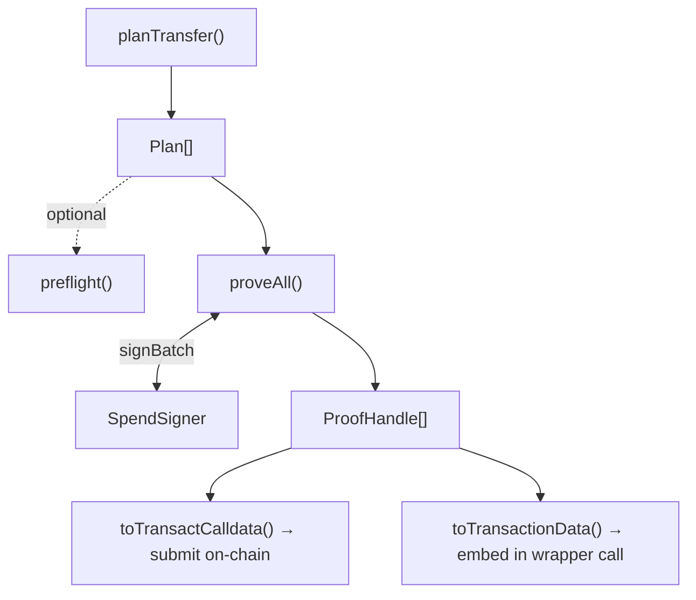

# Transactions

Moving shielded funds is a three-step flow:

1. **Plan** — select the notes to spend and compute the outputs and change.
2. **Preflight** — run cheap checks before committing to the expensive proof (optional).
3. **Prove** — generate the zero-knowledge proof and produce the calldata to submit on-chain.

A **transfer** sends funds to another shielded (`0zk`) address. An **unshield** withdraws funds to a
public address. A single plan can do both at once.



## Fees

Planning requires a fee quote. A quote is issued by the broadcaster that will submit your
transaction, and the SDK consumes it as-is:

```ts
interface FeeQuote {
  schedule: Record<string, string>;    // per-operation fees, USDC base units (6dp), as strings
  broadcasterShieldedAddress: string;
  feesCacheId: string;
  expiresAt: number;                    // unix seconds
}
```

`schedule` is keyed by operation (`transfer`, `unshield`, …). How you obtain a quote is specific to
your deployment's broadcaster.

Each scheduled fee is charged **per proof**. Most spends are a single proof and pay it once; a
[split spend](#fragmented-wallets-split-spends) of k proofs pays it k times, because every proof costs
the broadcaster its own verification gas.

## Plan a transfer

`planTransfer` selects input notes and builds the plans for one spend — an array with one `Plan` per
proof. Each output is a shielded address, an amount in the token's base units, and an optional memo:

```ts
const plans = await wallet.planTransfer({
  outputs: [{ to0zk: '0zk…', amount: 1_000_000n, memo: 'invoice-42' }],
  fee: feeQuote,
});
```

Almost always the array holds a single plan; see
[Fragmented wallets](#fragmented-wallets-split-spends) for when it holds more. The spent token
defaults to the pool's USDC; set `tokenAddress` to spend another token the wallet holds. Each plan's
`summary` describes its selection:

```ts
const [plan] = plans;
plan.summary.inputTotal;  // total value of the selected input notes
plan.summary.outputs;     // the resolved outputs
plan.summary.changeValue; // change returned to the wallet
plan.summary.feeOutput;   // the fee note, when one is present
```

If no single tree's spendable notes can cover the amount plus one fee, `planTransfer` throws
`InsufficientBalanceError`. If the pool config lists `supportedShapes`, every plan lands on a listed
circuit shape; a spend that can't is rejected up front with `UnsupportedCircuitShapeError`, rather
than failing later during proving.

### Fragmented wallets: split spends

A proof's circuit shape is its number of input notes by its number of output notes, and a
deployment only has circuits for some shapes. A wallet holding many small notes can need a shape
that doesn't exist — say, five inputs paying a recipient, the fee, and change.

When the only thing standing in the way is the change note, and the change is no more than one fee,
`planTransfer` pays the change to the broadcaster with the fee instead of returning it. The plan then
needs one output fewer and fits a listed shape. The fee note is larger than the quote, but it is
always cheaper than the alternatives: an extra plan, or consolidating first, costs at least one more
fee. This applies to every spend, unshields included.

Otherwise, when the pool config lists `supportedShapes`, `planTransfer` splits a single-recipient
transfer across several plans, each on a listed shape, submitted together as **one atomic
transaction**:

- the recipient receives the amount as several notes (one per plan that pays it), with the memo on
  the first;
- the fee is charged once per plan (see [Fees](#fees)) and may itself span plans;
- change comes back in the last plan.

A split holds at most four plans. A wallet too fragmented to fit throws `TooFragmentedError`, as
does one whose balance covers the amount plus one fee but not the extra fees a split needs.
Unshields and multi-recipient spends are never split; if their shape isn't listed they throw
`UnsupportedCircuitShapeError`. With the deployed circuits that happens when an unshield needs five
or more notes and leaves more change than one fee. Both are fixed by
[consolidating](#consolidating-notes) first.

### The most you can send

Because a transfer spends one tree's notes and a split pays the fee once per plan, the largest
amount you can send is not simply the balance minus one fee. `maxTransferAmount` works it out with
the same rules `planTransfer` uses, so `planTransfer` accepts the amount it returns:

```ts
const max = await wallet.maxTransferAmount({ fee: feeQuote }); // USDC by default; 0n if nothing can be sent
```

Unshields have their own max. An unshield is never split, so it is limited to what one plan can
spend, less one fee at the tier its destination selects:

```ts
await wallet.maxUnshieldAmount({ fee: feeQuote }); // a plain unshield
await wallet.maxUnshieldAmount({ fee: feeQuote, unshield: { recipient: pool, adaptParams } }); // cross-chain
```

Notes held by a pending spend are left out of both, as they are for `planTransfer`.

### Consolidating notes

`consolidate` merges one token's notes into fewer notes that the wallet owns, in one atomic
transaction of up to four proofs. Prove and submit it like any other spend:

```ts
const plans = await wallet.consolidate({ fee: feeQuote }); // USDC by default
// or: wallet.consolidate({ tokenAddress: vaultShares, fee: feeQuote })
const proofs = await wallet.proveAll(plans);
```

- **Order.** Notes in older merkle trees go first. Spending them moves their value into the pool's
  current tree, so a balance split across trees becomes one balance again. Then the smallest notes
  in the current tree.
- **Fee.** Every proof pays the quoted `transfer` fee, in USDC. When consolidating another token,
  one extra USDC plan pays the fee for the whole batch.
- **What's left alone.** A lone note in the current tree (merging it changes nothing), and dust
  worth no more than the fee it would cost to merge. When nothing is worth merging, `consolidate`
  throws `NothingToConsolidateError`.
- **More than one round.** A run merges what fits in four proofs. Run it again for the rest.

Before paying for a merge, check whether it unblocks a spend. `planTransferAfter` plans the spend
against the wallet as it will be once the consolidation confirms:

```ts
const merge = await wallet.consolidate({ fee: feeQuote });
await wallet.planTransferAfter(merge, unshieldRequest); // throws if it still won't work
```

Each `balances()` entry's `spendableNotes` counts the notes behind its `spendable` amount. A high
count is the cue to consolidate.

## Unshield to a public address

Add an `unshield` to withdraw to a public recipient. Outputs and an unshield can be combined in one
plan:

```ts
const [plan] = await wallet.planTransfer({
  outputs: [],
  unshield: { recipient: '0x…', amount: 1_000_000n },
  fee: feeQuote,
});
```

An unshield is never split, so it always plans as a single proof. The unshield is reflected in
`plan.summary.unshield` as `{ recipient, value }`. For cross-chain
unshields, `unshield` also accepts `adaptParams` and `adaptContract` that bind the destination into
the transaction; a decoded `adaptBinding` is surfaced to the signer for inspection.

## Preflight

`preflight` runs a set of cheap checks over the plans before proving — pass the whole array so a
split spend is checked as the one transaction it submits as. It returns an overall `ok` plus a
finding per check — it never proceeds on its own, so the caller decides what to do:

```ts
const { ok, findings } = await wallet.preflight(plans, { feeQuote });

if (!ok) {
  for (const finding of findings.filter((f) => !f.ok)) {
    console.warn(finding.check, finding.detail);
  }
}
```

Each finding's `check` is one of `root-freshness`, `nullifier-unspent`, `fee-quote-expiry`,
`balance-sufficiency`, `cctp-liveness`, or `shield-pause`. Preflight works on view-only wallets too.

## Prove

`proveAll` requests signatures from the wallet's signer, generates one proof per plan, and returns a
`ProofHandle` per plan, in order. The signer is asked **once**, with every plan's intent in a single
batch, so a split spend is approved as a whole. It requires a spend-capable wallet — calling it
without a signer throws `NoSpendCapabilityError` (see [Wallets](./wallets)):

```ts
const proofs = await wallet.proveAll(plans);
```

`prove(plan)` proves a single plan and returns one `ProofHandle`; the examples below use it for
brevity, and `proveAll` takes the same options.

Proving is a long operation. Pass an `AbortSignal` to cancel it and an `onProgress` callback to track
it:

```ts
const controller = new AbortController();

const proof = await wallet.prove(plan, {
  signal: controller.signal,
  onProgress: (p) => console.log(p),
});
```

Cancelling through the signal throws `AbortedError`. With `proveAll`, `onProgress` covers the whole
batch: the fraction runs from 0 to 1 once across all plans, rather than restarting for each proof.

### Persisting recoverable metadata

Pass `selfMetadata` to stash an opaque string in the spend's change-note memo. The change note is owned
by the wallet, so a fresh chain scan reproduces the blob on `history()` even after local storage is
cleared — use it for details that aren't otherwise recoverable (a fee breakdown, submission mode, a
quote id):

```ts
const proof = await wallet.prove(plan, { selfMetadata: 'fee=20000;mode=gasless' });
```

It rides in the change note, so it's ignored when the spend has no change (`changeValue === 0`). On
recovery it surfaces as `selfMetadata` on the transaction's history entry. Keep it compact — it costs
calldata gas, and a non-empty change memo is a faint metadata-presence signal to observers (the content
stays encrypted).

## Submitting on-chain

A `ProofHandle` owns the calldata for the transaction it proved. `toTransactCalldata()` returns what
you need to submit it with your own provider:

```ts
const { to, data, value } = proof.toTransactCalldata();
// send { to, data, value } with your wallet / provider
```

A split spend's proofs must land together. Combine them into one `transact()` call so they settle
atomically:

```ts
import { buildTransactCalldata } from '@armada/sdk';

const { to, data, value } = buildTransactCalldata(
  proofs.map((p) => p.toTransactionData()),
  poolAddress,
);
```

For wrapper calls — cross-chain unshields and yield flows — use `toTransactionData()` to get the
proved transaction struct to embed in the wrapper call instead of the bare `transact()` calldata.

A handle can be invalidated once used: `invalidate()` marks it spent, `isValid` reflects its state,
and `expiresAt` is set when the proof has a validity window.

## Tracking in-flight spends

A note is only removed from the wallet's spendable set once its on-chain `Nullified` event has been
scanned. Between submitting a spend and that event arriving, the input notes still look spendable — so
two spends issued in quick succession can select the same note, and the second reverts on-chain with
`Note already spent`.

After you submit, call `markSpendPending` with the plans and the transaction hash. The wallet holds
their input notes out of selection and out of the `spendable` balance until the spend confirms. Pass
the whole array, so a split spend holds every plan's notes:

```ts
const proofs = await wallet.proveAll(plans);
const { to, data, value } = buildTransactCalldata(proofs.map((p) => p.toTransactionData()), poolAddress);
const txid = await submit({ to, data, value }); // your provider / broadcaster

wallet.markSpendPending(plans, txid); // a rapid follow-up planTransfer now skips these notes
```

The hold is released automatically when the spend's `Nullified` event is scanned. If the transaction
is dropped or reverts, release the notes immediately so they can be respent:

```ts
wallet.clearSpendPending(txid);
```

As a safety net, holds also expire after `pool.pendingSpendTtlMs` (default 5 minutes), so a submission
that never confirms — even across a reload — can't lock its inputs forever. While held, a note's value
is reported under `pendingSpent` (rather than `spendable`) in the `balances()` entry for its token.

`markSpendPending` requires a spend-capable wallet; `clearSpendPending` is always safe to call. This
matters for apps that issue spends back-to-back; a serialized one-at-a-time flow that refreshes
balances between transactions is unaffected.
